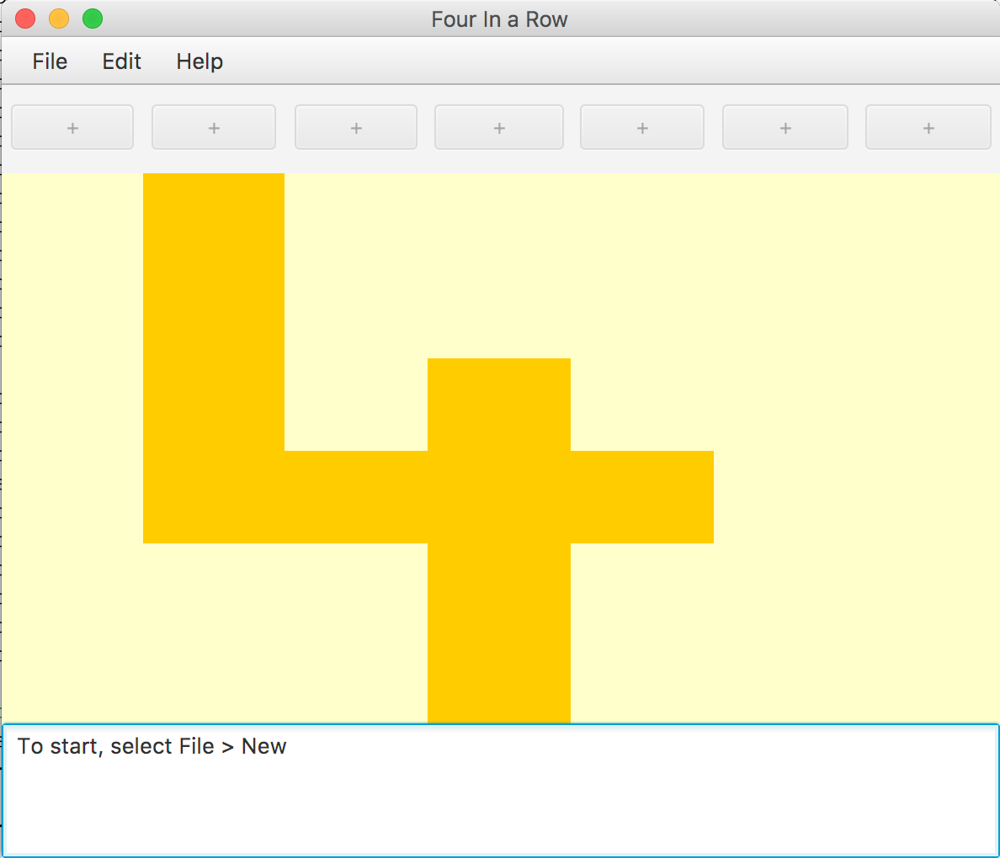

# Four In A Row
This application represents the starting point for a laboratory/workshop on writing unit tests. 

This is simple implementation of a Four In A Row application is provided. It as a JavaFX GUI and it has some logic to manage the game. The focus is on writing tests and refactoring the code to make it easier to test. The laboratory sheet will describe your task and what stories you will work on and what tests you will run.



Players can take it in turn to add a new piece to one of the columns in the game. 


The game does not currently detect if a player has won - that is one of the stories for the laboratory.

## Building the project
The project is built using [Maven](https://maven.apache.org). 

## Java Version
The build file `pom.xml` specifies that Java 8 should be used. This should also work for anyone using Java 9 or Java 10. 

If there are any problems, it is easy to change to a different version. Only make this change if you find problems running the build process. 

To make that change, find the following part of the build file: 

```
<plugin>
    <artifactId>maven-compiler-plugin</artifactId>
    <version>3.8.0</version>
    <configuration>
        <source>1.8</source>
        <target>1.8</target>
    </configuration>
</plugin>
```
To specify using Java 10, instead of Java 8, change `source` and `target` from `1.8` to `10`.

### Building from the command line
To run the tests, you can type the following at the command line.

```
mvn test
```

Other maven stages setup in `pom.xml` include: 

* `jacoco:report` - Runs the report to generate the code coverage output. The html files with the code coverage report can be found in `target/site/jacoco`. 
* `javadoc:javadoc` - Generates the Javadoc output. This will be stored in `target/site/apidocs/`.
* `assembly:single` - Creates a runnable Jar file. This will be the file `target/laboratory-four-in-a-row-1.0-jar-with-dependencies.jar`. If you are in the same directory as the `pom.xml` file, you can run this file with the command line `java -jar target/laboratory-four-in-a-row-1.0-jar-with-dependencies.jar`.

You can always clean the existing build using the following command. 

```
mvn test
```
This will delete the `target` directory and all of its contents. 

You can run cominations of targets, for example, the following will run clean, the tests and generate the code coverage report.  

```
mvn clean test jacoco:report`
```

### Building from the IDE
IntelliJ IDEA and Eclipse provide Maven integration.

For Eclipse, run a maven build and then choose which of the goals to run. You only need to list the goals, you don't need to type mvn. For example, to run the goals to clean, run tests and generate the code coverage report, you can type the following list of goals into the Eclipse dialog.

```
clean test jacoco:report`
```

For IntelliJ IDEA, you can run the tests from within the IDE as normal. There is a Maven Projects tool window. See the help file [Executing Maven Goal](https://www.jetbrains.com/help/idea/2017.1/executing-maven-goal.html) from the IntelliJ help files for instructions. 


## FXML files
The user interface is defined in FXML, a format that is used by JavaFX. The files are located in [src/main/resources](src/main/resources), following the same package structure as the class files. The FXML files have been created using the open source editor from Oracle. This is called SceneBuilder. A company called Gluon offers this for [download](http://gluonhq.com/products/scene-builder/).
